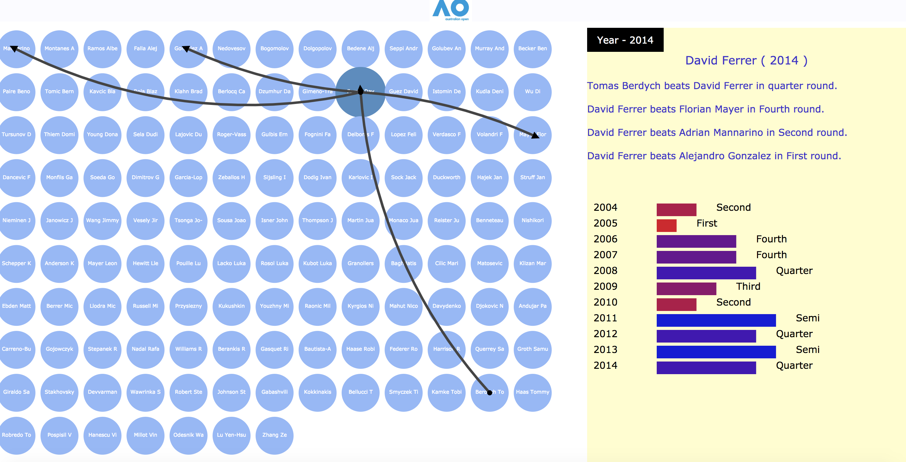

Summarization of Australian Open - 2004 to 2014

Data Analysis and Visualization:
R is used to create the required JSON files for this project. R is used to divide the given data into data for each year starting from 2004 to 2014. R’s sqldf library is used to filter the data.
Json files are created from the given data are used for the visualization. It includes the player names and the level they reached during each year along with various other details. This information is used to create a visualization which depicts which player defeated which other players. The visualization and the interaction is divided into 3 main parts:
1. Year Select: This interaction allows the user to select the year from 2004 to 2014 for which the data is to be visualized. Once the year is selected the visualization appears on the left with circles indicating the players who played in that year. User can interact with the visualization by hovering the mouse over the circles.
2. Arrows: Once the circle is selected the arrow pops up. These arrows have a head and a tail. The head points to the player who lost and the tail points to the winner.
3. 10 Year description: Once the circle is selected, the player details pops up on the right. This shows the selected player name and the players against whom he played in that year and whether he won or lost. This visualization also depicts the level (of rounds) he reached in those 10 years.
This visualization gives brief overview of who played against whom in a particular year and also the level a particular player reached in all the 10 years. The number of arrows going out of a particular player gives the level the player reached in that year and the arrow which points towards the selected player shows he lost that particular match. All the players, except the winner, will have one arrow pointing towards him.
d3.scaleLinear() is used to create the bar charts for number of rounds a player won and also to create the color in continuous range from red to blue. If the player loses in initial rounds the bar graph will have more of red color and it will be blue for the winner.

Here is the Screenshot:

